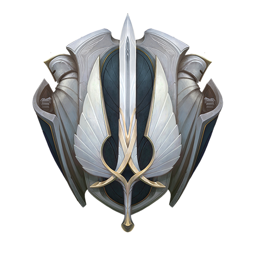

# DEMACIA

## À propos

Le projet consiste en une todolist, sans front, avec les fonctions :

    -Afficher les taches

    -Ajouter une tache

    -Afficher une tache

    -Supprimer une tache

    -Supprimer toute les taches

## Table des matières

- 📦 [Prérequis](#prérequis)
- 🚀 [Installation](#installation)
- 🛠️ [Utilisation](#utilisation)
- 🏗️ [Construit avec](#construit-avec)

## Prérequis

Avoir python installé sur son ordinateur.

## Installation

Télécharger et dézipper.

## Utilisation

Dans un terminal se placer dans le dossier et effectuer la commande :

    -   py app.py

## Construit avec

### Langages

Le code est en python.

### Outils

#### CI

CircleCI
